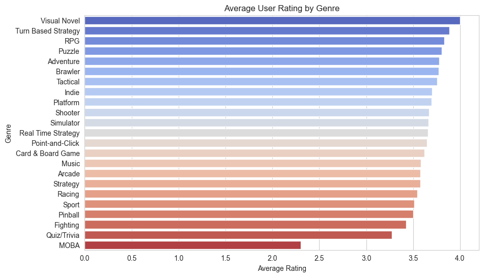
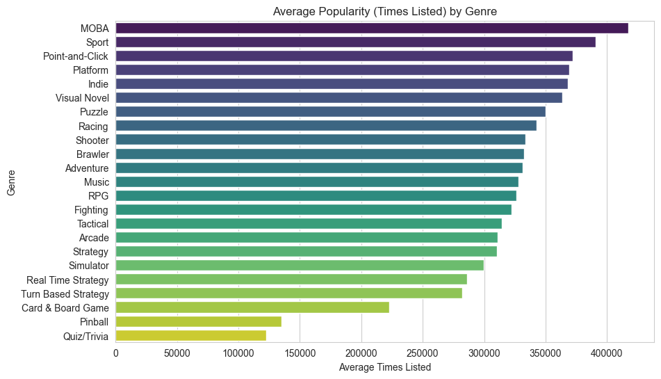
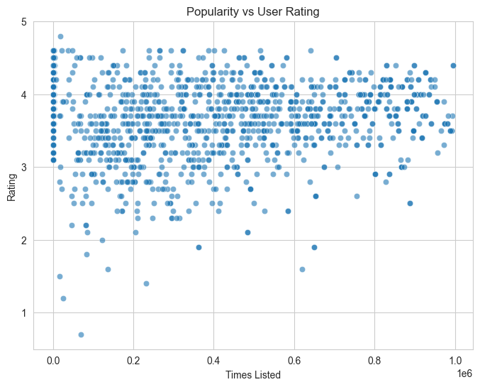

#### My Repository
https://github.com/Jeniroquema/Jenifer.github.io.git

### An Exploratory Analysis of Video Game Ratings and Popularity Across Genres
Video games are a major part of modern media and technology culture, with thousands of titles released across decades and genres. However, determining what makes a game popular or highly regarded is not always straightforward. This project explores the question: How does game genre relate to indicators of popularity in a large video game dataset? Specifically, it examines which game genre tends to receive higher user ratings and how popularity relates to genre and user reception.
This question is interesting and relevant because popularity is often assumed to reflect quality, yet highly visible, frequently listed games may not always receive the highest user ratings. Understanding this relationship can help players make more informed decisions, assist developers in understanding audience reception, and highlight how trends and visibility influence perception. This analysis uses exploratory methods to examine associations between variables, without implying causation.

The dataset used in this project was obtained from Kaggle, and it contains information about video games released between 1980 and 2023, made from the community-driven website Backloggd. 
Each row in the dataset represents a unique video game, and the dataset includes multiple attributes describing the game, its reception, and its characteristics.
Key columns include:
- Title: The name of the game
- Release Date: The date of the game’s first release
- Team: The developer or team responsible for the game.
- Rating: The average user rating, representing how players have reviewed the game.
- Times Listed: The number of users who have added this game to their backloggd profile, serving as an indication of popularity.
- Number of reviews: The total number of user reviews submitted for the game.
- Genres: All genres associated with the game, describing its gameplay or style.
- Summary: A short description of the game provided by the development team.
- Reviews: The actual user reviews submitted for the game.

The dataset contains several thousand games, spanning over four decades, which allows for exploration of long-term trends in game genres, ratings, and popularity. Some data may be missing or incomplete, for example, not every game may have a high number of reviews or a full genre classification. Additionally, some games were released decades ago, before online communities and rating platforms were widespread, so older titles may have fewer ratings or reviews, and their popularity may not be fully captured compared to more recent releases. Because popularity is community-driven rather than measured by sales, this analysis assumes that user ratings, reviews, and times listed serve as reasonable proxies for popularity and audience reception.

Before analyzing the video game dataset, several cleaning and preparation steps were performed to ensure consistency and interpretability:

- **Initial inspection:** The dataset was loaded and inspected to understand its structure, data types, and missing values. No duplicate rows were found, so no records were removed.

- **Focused columns:** Only the variables relevant to the research question were retained: title, genres, user rating, times listed, and number of reviews.

- **Popularity metrics conversion:** Columns like 'Times Listed' and 'Number of Reviews' used abbreviations such as "3.9k". These were converted to numeric values to enable accurate analysis and comparison.  

```python
def convert_k(value):
    if isinstance(value, str):
        value = value.replace('K', '')
        return float(value) * 1000
    return value

df['Times Listed'] = df['Times Listed'].apply(convert_k)
df['Number of Reviews'] = df['Number of Reviews'].apply(convert_k)
df.head()
```
 
- **Assumptions & trade-offs:**
  - Abbreviated popularity values were assumed to be consistent.
  - Retaining only complete values ensured analysis integrity while slightly reducing dataset   size.
  - Multi-genre games were treated as separate rows, which may slightly over-represent those games in genre-level analyses.

These steps ensure the dataset is consistent and interpretable while also maintaining as much information as possible. 

The first visualization I created was a horizontal bar chart showing the average user rating for each game genre. The reasoning behind this was because it makes it easy to compare averages across categories, the layout has easier readability since genre names can get long and it ties into the question: Which genres are rated highest by users?

### Average Rating by Genre


Based on the chart, we are able to see that the Visual Novel, Turn Based Strategy, RPG, and Puzzle genres have the highest average ratings, around 3.8-4.0. MOBA and Quiz/Trivia appear at the bottom, which noticeably lower average ratings. Most genres cluster between 3.4 and 3.8, suggesting ratings are generally positive.
From this we can interpret that Story-driven and strategy focused games tend to receive stronger user satisfaction. Highly competitive and MOBAs may receive more mixed reviews, possibly due to larger audiences and higher expectations. Now we know which genres are most well received, not just most popular, which is important when comparing quality vs popularity. 


In my second visualization, I created another horizontal bar chart that shows the average number of times games are listed for each genre, a proxy being used for popularity. I decided on another bar chart because popularity varies widely and with this I can identify relative differences by matching it with the rating chart for comparison. This also answers the question: Which genres are most common or popular?

### Average Popularity by Genre


From what we are able to gather, MOBA and Sport genres are the most popular, with the highest average times listed. Platform, Indie, and Visual Novel also rank high in popularity, with Quiz/Trivia and Pinball being the least favored genres.
From this, we are able to suggest that popularity does not necessarily mean higher ratings, genres with a larger player base may attract more listings but also more criticism. It’s also worth noting that niche genres may appear less often but still perform well in user satisfaction. This visualization shows what players are engaging with the most, allowing comparison against ratings to see whether popularity aligns with quality.

My third visualization is a scatter plot comparing Times Listed (popularity) on the x-axis and User Rating on the y-axis. I chose this for easy exploration between two numeric variables and it helps support the question: Does higher popularity correlate with higher ratings?

### Popularity vs User Rating


From what we can pull from this, we can see that ratings are mostly concentrated between 3.0 and 4.8, regardless of popularity as well as there being no strong linear correlation between popularity and rating. Some highly popular games have average or lower ratings while some less popular games receive very high ratings.
This pattern indicates that popularity does not guarantee higher user satisfaction and well rated games can exist without mass exposure, larger audiences may lead to more varied opinions, which can lower average ratings. This visualization suggests that quality and popularity are not strongly correlated, reinforcing the findings from the genre comparison. 

While this analysis provides insight into the relationship between game genres, popularity, and user ratings, it also has several limitations that should be acknowledged. 
First, the dataset does not capture all possible measures of popularity or success. Popularity in this project is measured using “Times Listed” and the number of reviews, which reflect engagement on the Backloggd platform rather than actual sales, revenue, or total player counts. As a result, games that are widely played but less frequently tracked on the platform may appear less popular than they truly are. Additionally, older games released before online tracking communities became common may be underrepresented in terms of reviews and listings.
Potential biases could be present in the data due to its community driven nature. Users who rate or list games are likely more engaged or opinionated than casual players, which may skew ratings towards stronger feelings, positive and negative. Certain genres, such as competitive multiplayer games, could attract larger and more vocal audiences, leading to divided ratings. In contrast, niche or story driven games may be rated primarily by dedicated fans, which could increase their average ratings.

A few assumptions were made during the cleaning and analysis process that could affect the interpretation. Converting abbreviated values such as “K” into numeric form assumes consistency across all entries. The analysis also treats average ratings as comparable across genres, even though the number of reviews varies significantly between games. On top of that, genres were analyzed as categories without accounting for games that span across multiple genres, which could possibly oversimplify how genre influences the players experience.

One surprising outcome of this analysis was the weak relationship between popularity and user ratings. It might be expected that the more well-known a game is, the higher the rating, but the scatter plot showed that highly rated games can exist without widespread popularity, and extremely popular games tend to receive mixed reviews. This reinforces the idea that visibility and quality do not always correlate.

If I had more time or data, I would further explore including weighted ratings by the number of reviews to better account for sample size and incorporate additional metrics such as player counts or sales data. Perhaps even an analysis of written reviews to examine how player opinions differ across genres.

Overall, this project focused on both the value and limitations of using community generated data to explore media popularity and quality. While the findings are exploratory, they provided meaningful insights into how genre, engagement, and user perception interact in video game culture.

#### Sources: 
https://www.kaggle.com/datasets/arnabchaki/popular-video-games-1980-2023/data
https://www.codecademy.com/resources/docs/pandas/dataframe/explode
https://pandas.pydata.org/docs/reference/api/pandas.DataFrame.explode.html

###### AI Transperency Statement
###### ChatGPT (version 5.2) was used to help clarify the use of the pandas.DataFrame.explode() feature, refine explanations, and improve wording throughout the project. All coding, data cleaning, and analytical decisions—including implementing the explode() feature and interpreting results were made by me.
