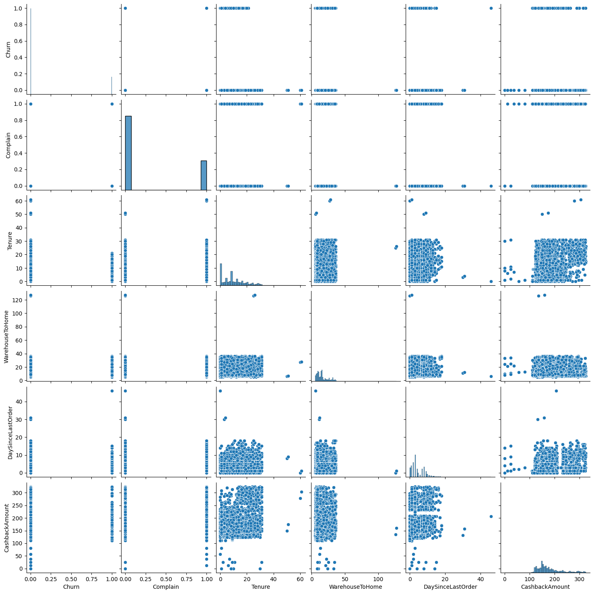
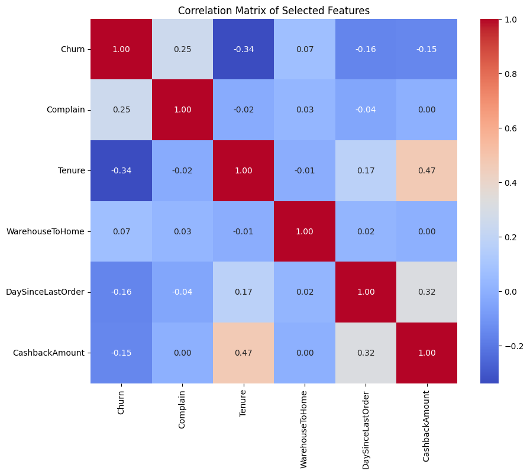
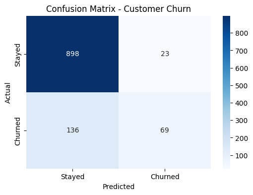
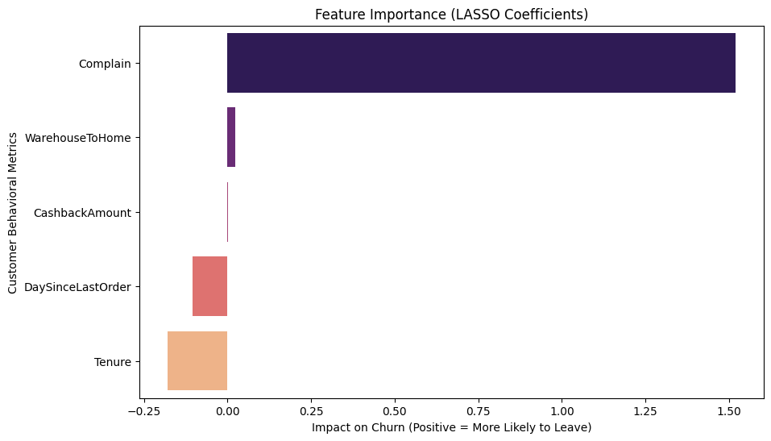

### The High Cost of “Goodbye”

#### Introduction
In e-commerce, retaining customers is considered to be more cost-effective than acquiring a new one. Customer Churn is the rate at which customers stop doing business with a product, business, or service; it is a silent killer of sustainable growth. According to Firework (2025), even a 5% percentage increase in customer retention can lead to a significant boost in long-term profitability.
This project investigates a critical business question: What behavioral “red flags” can predict when a customer is about to leave, and how can a company intervene before they do? This analysis is particularly relevant today as the ‘AI boom’ drives massive data expansion, companies have more power than ever to use that data to optimize digital services and maintain customer loyalty. 

#### Data
The data for this project was sourced from the "E-Commerce Customer Churn Analysis and Prediction” dataset available on Kaggle. It consists of over 5,600 observations of customer activity, providing a comprehensive look at how users interact with a retail platform.

Key columns include:
- Churn: Whether or not the customer left the platform  
- Tenure: How long the customer has been with the company
- WarehouseToHome: Distance from the warehouse to the home of the customer
- Complain: Whether a customer has raised a concern recently
- SatisfactionScore: The customer’s satisfaction with the service
- HourSpendOnApp: Number of hours the customer has been on the platform
- DaySinceLastOrder: A measure of how recently the customer has ordered on the platform
- CashbackAmount: Average cashback reward in the last month
- NumberOfDeviceRegistered: Total number of devices registered for one customer

While the dataset provides a good foundation for predicting churn, several technical and behavioral assumptions were made to ensure the model’s integrity. For example, this analysis operates under the assumption that there is a single user for each unique CustomerID, meaning it represents one individual rather than a shared household account. Shared usage could potentially noise behavioral metrics, such as hours spent on the app or order frequency, and mask the drivers of individual churn. Additionally, it is important to acknowledge the presence of missing values in the Tenure and WarehouseToHome columns, these gaps were addressed through median imputation to maintain a complete dataset without skewing the overall distribution. Finally, while the variables identified show strong associations with customer departure, this study identifies patterns of correlation rather than direct causation, serving as a predictive guide rather than a definitive explanation of human behavior.

#### Preprocessing and Exploratory Data Analysis
While the original dataset contained 20 variables, this analysis was trimmed to focus on six predictors: Churn, Complain, Tenure, WarehouseToHome, DaySinceLastOrder, and the CashbackAmount. These specific variables were selected to avoid overfitting and to focus the model on the most significant behavioral, loyalty, and logistical triggers. By removing redundant features like CityTier or Gender, the model remains efficient and focuses purely on actionable customer patterns.
Upon the review of the e-commerce dataset, missing values were identified in three key features: Tenure (264 nulls), WarehouseToHome (251 nulls), and DaySinceLastOrder (307 nulls). To maintain the integrity of the 5,630 observations without discarding valuable data, median imputation was performed. The median was selected over the mean to ensure that outliers did not artificially skew the distribution. After the imputation, a final verification confirmed a complete dataset of 5,630 non-null entries across all six selected variables.

##### (Figure 1)

This pairplot confirms a significant class imbalance in our target variable, meaning there are far more customers who stayed than those who left. Because the ‘Churn’ group is the minority, we will prioritize specialized metrics (ROC-AUC) to ensure the model doesn’t get ‘lazy’ by simply guessing that everyone stays.
Take a look at the scatter plot where Churn is on one axis and Complain is on the other. You’ll see that while many people stay (0) regardless of complaints, a huge chunk of those who left (1) have a complaint maker. This suggests a strong relationship between customer complaints and churn behavior, identifying ‘Complain’ as a likely high-importance feature for our predictive model.

##### (Figure 2)

In addition, a Correlation Matrix was performed to check for multicollinearity among the selected features. The analysis showed that all variables maintained a correlation below 0.50, indicating that each feature provides unique predictive value without redundancy. While these individual correlations appear moderate, this is a characteristic of behavioral data where no single factor indicates a customer’s decision. Specifically, Tenure showed the strongest negative relationship with Churn (-0.34), suggesting that loyalty grows over time, while Complain showed a positive relationship (0.25), serving as a primary “red flag” for departure. 

#### Modeling
To ensure an unbiased evaluation of customer churn, a three-step workflow was implemented. First, the data was split into 80% training and 20% testing sets. 

The primary model implemented was Logistic Regression with LASSO (L1) Regularization. This was chosen because it acts as a filter, automatically penalizing less important variables so that we can focus strictly on the most reliable predictors of Churn. Performance was evaluated using the ROC-AUC score to effectively measure the model’s ability to distinguish between customers who stay and those who leave, despite the class imbalance observed in the exploratory phase. 

#### Results
The LASSO Regression model was trained on the training subset and then evaluated on the unseen testing set. This returned a Test ROC-AUC Score of 0.8317 and an overall Accuracy of 0.8588. These results indicate that the model does a strong job at distinguishing between loyalists and at-risk customers. While the accuracy is high, the Confusion Matrix (Figure 3) provides a more nuanced view, showing that the model correctly identified 898 retained customers while successfully flagging a segment of the at-risk population for intervention.

##### Figure 3: Confusion Matrix showing the distribution of predicted vs. actual churn. The model correctly identified 898 retained customers.

When analyzing the variables that influence the model’s performance (Figure 4), Complain (1.44) was the most significant predictor, drastically increasing the likelihood of churn. Conversely, Tenure (-0.18) and DaySinceLastOrder (-0.11) carried negative weights, meaning that deeper loyalty and more recent activity strongly push a customer toward staying. Interestingly, features like CashbackAmount had nearly zero influence, suggesting that financial incentives may be less powerful than high-quality service and complaint resolution. 

##### Figure 4: LASSO Coefficients illustrating feature importance. Positive values (Complain) increase churn risk, while negative values (Tenure) decrease it.

Based on these results, the company should prioritize a rapid response system for customer complaints. Since complaints are the primary “red flag” for departure, resolving these issues in real-time could significantly increase retention and long-term profitability.

#### Sources: 
https://www.kaggle.com/datasets/ankitverma2010/ecommerce-customer-churn-analysis-and-prediction
https://firework.com/blog/customer-retention-statistics

###### AI Transperency Statement
###### Gemini was used to troubleshoot code error messages, optimize the LASSO regression syntax, and refine explanations throughout the project. All data cleaning, feature selection, and analytical decisions, including the implementation of median imputation and the interpretation of model coefficients were made by me.
