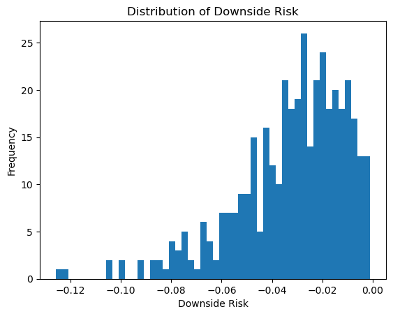
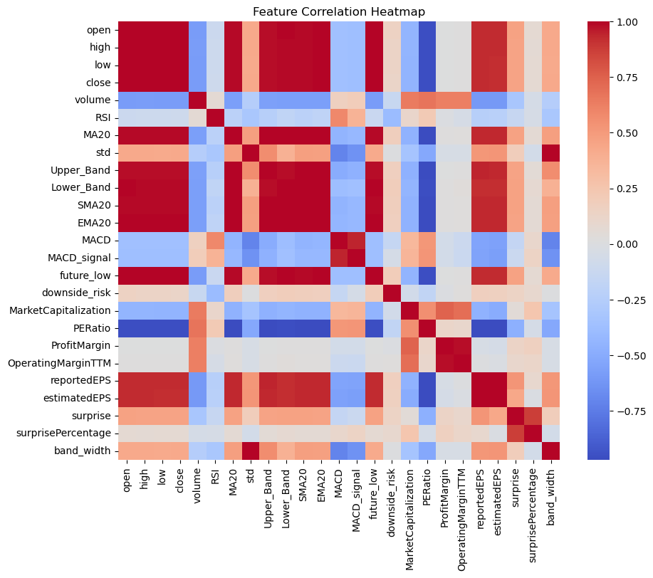
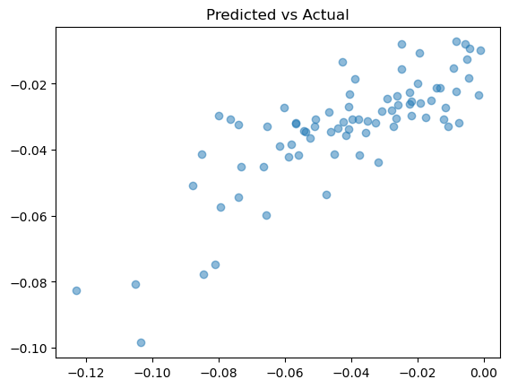
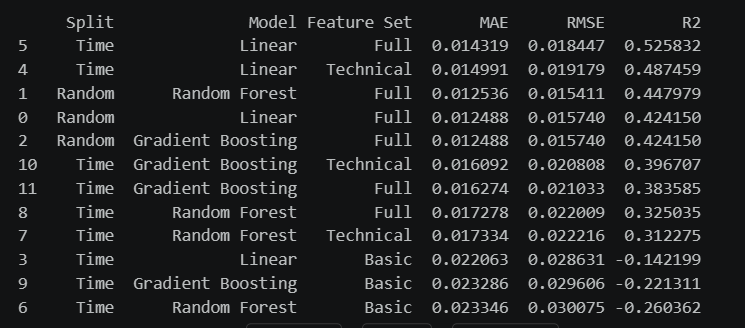

### The Anxiety of the “Unknown Drop”

#### Introduction
Most people view the stock market as a game of guessing whether a price will go up or down. But for the everyday investor, the real fear isn’t missing out on a small gain, it’s the sudden, sharp decline that can wipe out months of savings. In this project, we wanted to apply a predictive curiosity to financial stability

##### Figure 1: The Distribution of Risk. Most daily movements are small, but the 'tail' on the left represents the rare, sharp declines that our project aims to forecast.

Our team’s research question came down to this: Is a market crash truly unpredictable, or are there vital signs in the data that suggest a drop before it happens? We focused on modeling the specific magnitude of “downside risk” (the maximum percentage a stock might fall over a five day window) for five technology leaders: Apple, Microsoft, Nvidia, Google, and Amazon. 

#### Investigation: Building the Warning System

##### Figure 2: Feature Correlation Heatmap. This allowed us to identify which market 'vital signs' were most closely linked to price drops.

To investigate this, we moved beyond simple price watching and built a multivariate pipeline that combined:
- **Momentum (The Overheating):** RSI and MACD to track the speed of price changes.
- **Volatility (Turbulence):** Bollinger Bands and Standard Deviation to measure market instability.
- **Fundamentals (The Reality):** Integrating Quarterly Earnings to see if the company’s value supported its price. 

#### Key findings

##### Figure 3: Predicted vs. Actual Outcomes. The strong linear trend indicates that our model successfully identified the magnitude of market drops.

**Simplicity Wins**
We experimented with complex AI models to see if they could uncover deep, hidden patterns in the market. To do this, we tested two of the most popular methods:

* **Random Forest:** Imagine asking 100 different people for their opinion on a stock, and then taking the average of their guesses. This model creates hundreds of “decision trees” (mini flowcharts) and merges their results to get a more stable prediction. 
* **Gradient Boosting:** This model is like a student who takes a test, sees which questions they got wrong, and then retakes the test specifically focusing on those mistakes. It builds models one after another, each one trying to fix the errors of the previous one.

From these complex experts, we expected them to obtain the answers to our question, but instead, we discovered something fascinating: Linear Regression was the hero. While complex models were busy looking for intricate loops and patterns, a simple linear approach that looks for direct, straight-line relationships, achieved the highest accuracy. 

Our best model reached an R² of 0.526, meaning it successfully accounted for 52.6% of the variance in why these stocks dropped. Even more impressively, our predictions were usually within 1.4% of the actual market outcome.

##### Figure 4: Detailed Model Comparison. Our testing across different algorithms and feature sets demonstrated that Linear Regression with the 'Full' feature set was the most reliable predictor.

#### What We learned
This project reinforced that data science is more than just accurate code, it’s about communication and responsibility. I learned that even in a complex market, the simplest models often provide the most actionable insights. Moving forward, I am committed to building tools that don't just “predict numbers”, but provide clarity and security for the people behind the accounts. 

#### Why Do These results matter?
The broader impact of your work (e.g., societal implications (benefits - what it makes better or worse, ethical considerations - potential harms, and / or potential challenges to equitability)

**Societal Benefits: Stability**
For too long, advanced risk modeling tools have been locked away in “black boxes”, which are complex systems where the inner workings are hidden from the user, making it impossible to see how a prediction was reached. By demonstrating that a transparent, linear model can effectively suggest a “cliff” using public predictors like RSI, we can help level the playing field. This project provides a blueprint for a “warning light” system that everyday retail investors can use to protect their hard earned savings from sudden volatility. 

**Ethical Considerations: The Feedback Loop**
However, with great data comes great responsibility. There is a potential harm known as a “Feedback Loop.” If every investor uses the same AI warning system to predict a crash, it could trigger a mass sell-off, ironically contributing to the very same market collapse everyone was trying to avoid. As data scientists, we must consider how the widespread use of our models might actually change the behavior of systems we are trying to predict. 

**Potential Challenges to Equitability**
We also face the challenge of “Information Inequality”. While the code behind this project is open, the high speed data feeds required to run these models in real-time are often expensive. If only the wealthy can afford the hardware to run “risk-warning” AI, we risk widening the wealth gap even further. Our goal as future practitioners is to advocate for financial tools that are not just accurate, but accessible and transparent for everyone. 

###### AI Transparency Statement
###### Gemini was used to troubleshoot code syntax and refine the clarity of this portfolio. All core project decisions—including dataset selection, variable identification, and model implementation—were made by our team. The final analytical conclusions and interpretations of financial trends is original work, building our background in data science and prior research in data modeling.
###### [View the Technical Report](https://docs.google.com/document/d/1r-pa9ETgOIihCbjI67tR5w485km9CKFMN9YYilcSI_I/edit?usp=sharing)
