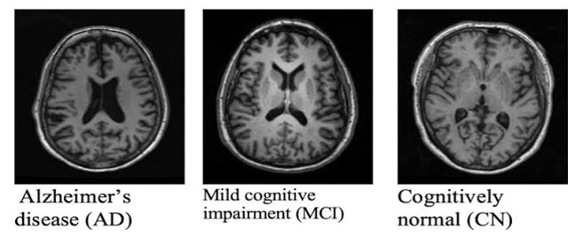
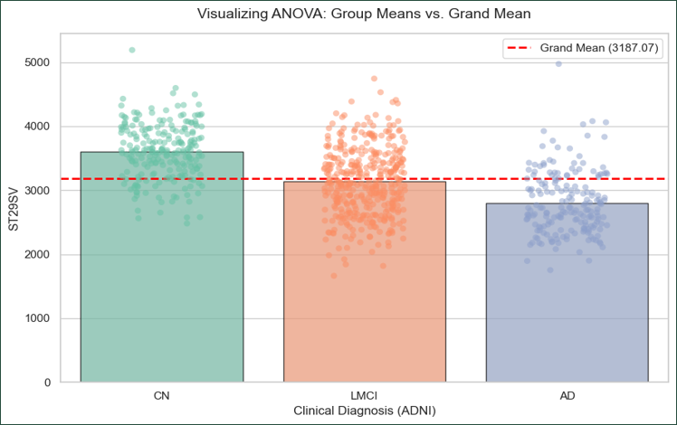
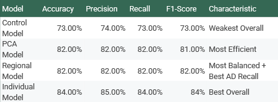

### The Architecture of Memory: Decoding Alzheimer’s with Machine Learning

#### Introduction
Alzheimer’s disease (AD) is a progressive, irreversible neurodegenerative disorder. For patients and their families, early detection at the Mild Cognitive Impairment (MCI) stage is critical before irreversible structural brain damage occurs. However, clinical MRI data is incredibly dense. High-dimensional structural MRI (sMRI) contains hundreds of localized features, making it difficult for doctors and machine learning models to determine which specific areas are most likely driving the diagnosis. 

##### Figure 1: MRI Data Sources. Brain structural data was sourced from the Alzheimer’s Disease Neuroimaging Initiative (ADNI) database, comparing Cognitively Normal, MCI, and AD cohorts.

Our team’s objective was to advance data-driven tools for early AD detection. We wanted to answer a core question: Can we map hundreds of complex brain features into a readable biological hierarchy, and use those statistical weights to help improve how machine learning models detect the disease?

#### Investigation: Building the Pipeline

##### Figure 2: Finding Weights via F-Statistic (ANOVA). We visualized the group means versus the grand mean to evaluate the statistical significance of individual brain features.

To investigate this, we couldn't just throw raw data at a model. We built a structured data engineering pipeline:
* **The Biological Mapping:** We processed 327 distinct structural brain features (like cortical volumes and thicknesses) and categorized them into 10 distinct macro-regions, such as the Temporal and Frontal Lobes.
* **The Statistical Weighting (ANOVA):** We ran an Analysis of Variance on individual structural measurements to find their F-Statistic and P-Value, mapping only the most significant features (p < 0.05) to their macro-regions.
* **The Machine Learning Application:** We applied these statistical weights to the data and trained Support Vector Machine (SVM) classifiers to observe if our anatomical grouping improved predictive performance compared to standard Principal Component Analysis (PCA).

#### Key findings

##### Figure 3: Model Performance Comparison. The Regional and Individual models outperformed the PCA model in our testing, particularly in AD-specific recall.

**Interpretability Beats Blind Compression**
We tested several weighting strategies to see which would give our SVM model the most accurate diagnostic tracking. 

* **The PCA Model:** A standard dimensionality reduction technique. While it compressed the data well, it yielded noticeably lower performance on AD-specific recall in this context.
* **The Individual Model:** Achieved the highest overall performance during testing with 84% Accuracy and an 84% F1-Score.
* **The Regional Model:** Provided the most balanced results and achieved the best AD-specific recall (82%). 

In medical diagnostics, **recall is paramount**. Recall represents the ability of a model to correctly identify all true positive cases—missing an actual AD diagnosis is dire. Our results indicated that ANOVA offers a highly stable method for ranking brain regions. While PCA provides a solid foundation for compressing complex features, it fell short in performance for this specific task. Ultimately, we found that regional ranking is best used as an interpretive lens to help understand the disease, rather than just a blind mathematical weight.

#### What We learned
This project reinforced the immense value of bridging domain knowledge (biology) with data science. I learned that feature engineering isn't just about cleaning numbers but rather about attempting to preserve the real-world context of the data. By taking the time to map 327 features to their actual anatomical regions, we developed a model designed to balance predictive accuracy with medical interpretability.

#### Why Do These results matter?

**Societal Benefits: Interpretable Diagnostics**
In the medical field, a "black box" AI model that predicts a disease without explaining *why* can be highly dangerous. By demonstrating how statistical methods like ANOVA can explicitly track the Temporal Lobe and other regions, we offer a framework for a more transparent tool. This aims to create a blueprint for diagnostic aids that doctors can more confidently trust, as the model's logic closely aligns with established neuroimaging literature.

**Ethical Considerations: The Cost of False Negatives**
When dealing with healthcare data, the stakes are incredibly high. Our focus on "Recall" highlights an ethical imperative in medical machine learning: a false negative (telling a sick patient they are healthy) delays critical intervention. Data scientists building medical tools must prioritize models that seek to minimize false negatives, even if it slightly reduces overall accuracy.

**Potential Challenges to Equitability**
We must also acknowledge systemic biases in medical datasets. Tools built on databases like ADNI rely on patients who have the resources, time, and access to participate in long-term MRI studies. If diagnostic AI is trained primarily on specific demographics with access to top-tier healthcare, the models may not perform as accurately for underrepresented or rural populations. True equitability requires diverse, inclusive data collection.
 
##### [See our team's poster! (PDF)](ADposter.pdf)

###### AI Transparency Statement
###### Gemini was used to troubleshoot code syntax and refine the clarity of this portfolio page. All core project decisions including dataset engineering, anatomical mapping, and model implementation were made by our team. The final analytical conclusions and interpretations of the medical data are original work, building our background in data science and biomedical analytics.
