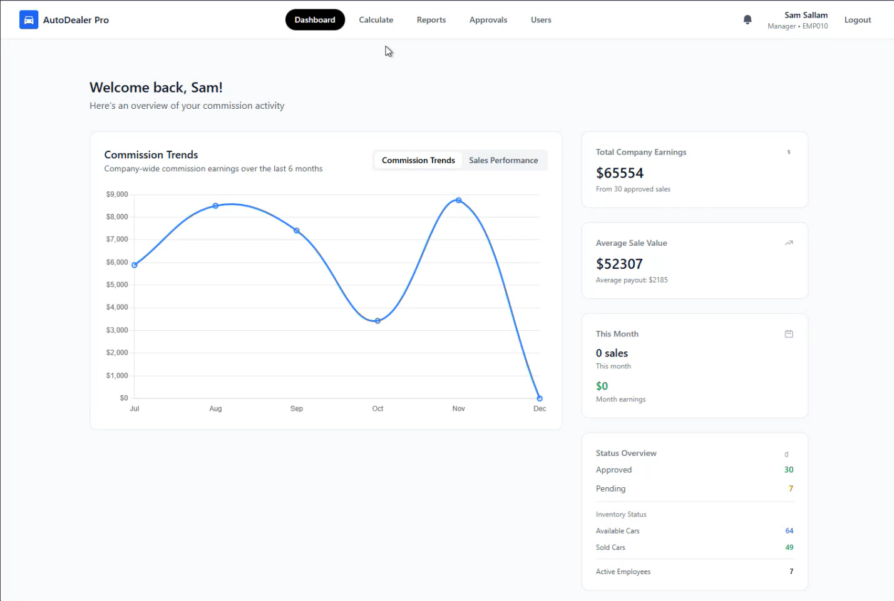
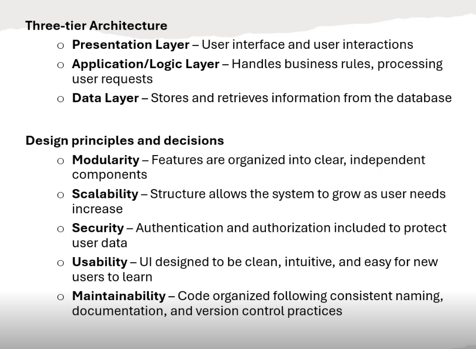
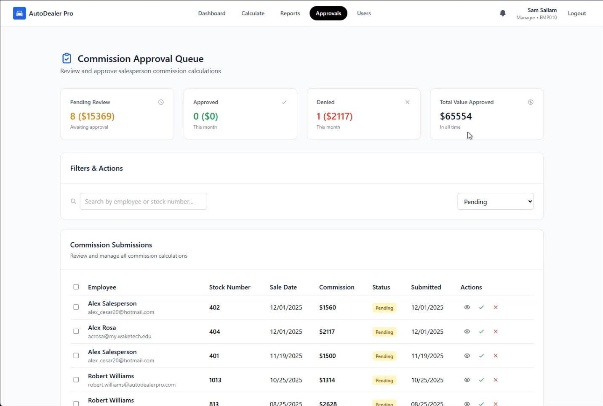

### AutoDealer Pro: Automated Commission Tracking & Multi-Tier Approvals

#### Introduction
In automotive sales, calculating commission payouts with spreadsheets or manual accounting is time consuming and prone to human error. Sales payouts often involve complex variables such as individual tax withholdings, 401(k) contribution rates, vehicle margins, and tiered manager approvals making monthly reconciliation opaque for both salespeople and management.

##### Figure 1: AutoDealer Pro Dashboard (`dashboard.html`). The central portal provides real-time visibility into active vehicle inventory, calculated net payouts, and pending manager evaluation statuses.

Our team set out to solve this by building **AutoDealer Pro**: an enterprise Django web application designed to replace spreadsheet guesswork with an automated, transparent, and secure commission pipeline.

#### System Architecture & Database Engineering

##### Figure 2: Schema & Security Architecture. Relational database mapping connects employee profiles (`EmployeeUser`) and inventory (`Car`) to transaction lifecycle tracking (`SaleReport`).

To handle complex payroll math accurately, we engineered a relational database schema in MySQL using custom Django models:
* **Custom User & Payroll Profiling (`EmployeeUser`):** Extends `AbstractUser` to store localized tax parameters (`tax_county`, `tax_state`, `tax_withholding`), `k401_contribution` percentages, and manager privileges (`is_manager`).
* **Inventory Tracking (`Car`):** Tracks vehicle attributes (`stock_number`, `vin`, `cost_price`, `sale_price`) and updates inventory statuses dynamically across `available`, `pending`, and `sold`.
* **Transaction Lifecycle (`SaleReport`):** Links sales representatives to specific vehicles while storing calculated `payout` amounts, tax `withholding` deductions, `status` flags (`pending`, `approved`, `denied`), and audit notes (`manager_note`).
* **Security & Onboarding (`invites` & `notifications` apps):** Integrates TOTP-based Multi-Factor Authentication (`totp_secret`, `mfa_enabled`) to protect sensitive manager evaluation queues (`commissionEvaluation.html`) and user invites (`create_invite.html`).

#### Investigation: Development, Testing, & AWS Deployment

##### Figure 3: Manager Evaluation Queue (`commissionEvaluation.html`). Managers evaluate pending sales, audit calculated withholdings, and log approval decisions with feedback notes.

**Testing Rigor**
To verify financial accuracy before production deployment, we executed a multi-tiered testing strategy:
* **Unit & Integration Testing:** Validated core math functions across Django apps as new features were added.
* **Regression Testing:** Ensured existing calculation logic remained stable during continuous feature updates.
* **End-to-End Automated Testing:** Utilized browser automation to simulate complete user journeys from sales entry through manager MFA verification and payout sign-off.

**Cloud Infrastructure (AWS)**
The platform was deployed on AWS infrastructure across staging and production environments:
* **Compute & Database:** Hosted using AWS EC2 (`t2.micro`) connected to an AWS RDS MySQL database instance.
* **Production Security:** Configured custom domain SSL/TLS encryption via Let's Encrypt and protected application credentials using AWS Secrets Manager.

#### Key Takeaways & Resilience
When our team size scaled down from six members to three mid-project, our remaining team adapted rapidly. By establishing clear ownership over backend models, UI templates, and AWS configuration, we delivered a fully functional, production-ready product on schedule.

#### Why Do These Results Matter?

**Business Benefits: Transparency & Accuracy**
Automating commission calculations eliminates payout friction between sales teams and management. By factoring individual 401(k) contributions and local tax withholdings directly into transaction logs, sales representatives gain immediate clarity on earnings while management maintains a clear audit trail.

**Security Considerations: Safeguarding Financial Workflows**
Payroll systems store sensitive personal and financial data. Incorporating TOTP multi-factor authentication and role-based access control helps protect administrative override functions and manager approval queues from unauthorized access.

**Future Scalability**
While currently validated through internal automated test suites, the application's modular Django architecture provides a foundation for future enterprise additions, such as direct external payroll API integration and comprehensive Dealer Management Systems (DMS) for inventory tracking.

##### [View the Repository on GitHub](https://github.com/Samdoodle/COMM_APP)

###### AI Transparency Statement
###### Gemini was used to troubleshoot code syntax, refine database schemas, and structure the content of this portfolio page. All primary project decisions—including database architecture, authentication logic, testing suites, and AWS deployment—were implemented by our development team.
